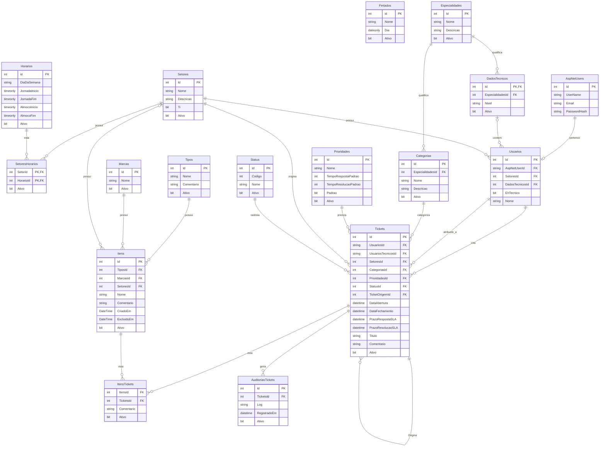

```mermaid
erDiagram
    %% Feriados
    Feriados {
        int id PK
        string Nome
        dateonly Dia
        bit Ativo
    }

    %% horários de funcionamento dos Setores
    Horarios {
        int id PK
        string DiaDaSemana
        timeonly JornadaInicio
        timeonly JornadaFim
        timeonly AlmocoInicio
        timeonly AlmocoFim
        bit Ativo
    }

    %% Setor da Empresa
    Setores {
        int Id PK      
        string Nome
        string Descricao
        bit Ti
        bit Ativo
    }

    SetoresHorarios {
        int SetorId PK, FK
        int HorarioId PK, FK
        bit Ativo
    }

    %% Especialidade: Redes, Banco de Dados
    Especialidades {
        int Id PK
        string Nome
        string Descricao
        bit Ativo
    }

    %% Dados Tecnicos
    DadosTecnicos {
        int Id PK, FK
        int EspecialidadesId FK
        string Nivel
        bit Ativo
    }

    %% Tabela Base do ASP.NET Identity (Mantida no padrão do framework)
    AspNetUsers {
        int Id PK
        string UserName
        string Email
        string PasswordHash
    }

    %% Usuario Comum (Herda de AspNetUsers)
    Usuarios {
        int Id PK
        string AspNetUserId FK
        int SetoresId FK
        int DadosTecnicosId FK
        bit EhTecnico
        string Nome
    }

    %% Prioridade e Prazos Configurados: Normal, Urgente
    Prioridades {
        int Id PK
        string Nome
        int TempoRespostaPadrao
        int TempoResolucaoPadrao
        bit Padrao
        bit Ativo
    }

    %% Categoria do Chamado: Redes, Hardware, Acessos
    Categorias {
        int Id PK
        int EspecialidadesId FK
        string Nome
        string Descricao
        bit Ativo
    }

    %% Notebook, PC, Roteador
    Tipos {
        int Id PK
        string Nome
        string Comentario
        bit Ativo
    }

    %% Dell, Acer, Samsung, Genérico
    Marcas {
        int Id PK
        string Nome
        bit Ativo
    }

    %% Ativos
    Itens {
        int Id PK
        int TiposId FK
        int MarcasId FK
        int SetoresId FK
        string Nome
        string Comentario
        DateTime CriadoEm
        DateTime ExcluidoEm
        bit Ativo
    }

    %% Aberto, Em Atendimento, Pendente, Resolvido
    Status {
        int Id PK
        int Codigo
        string Nome
        bit Ativo
    }

    %% Ordem de Serviço / Chamado
    Tickets {
        int Id PK
        string UsuariosId FK
        string UsuariosTecnicosId FK
        int SetoresId FK
        int CategoriasId FK
        int PrioridadesId FK
        int StatusId FK
        int TicketOrigemId FK
        datetime DataAbertura
        datetime DataFechamento
        datetime PrazoRespostaSLA
        datetime PrazoResolucaoSLA
        string Titulo
        string Comentario 
        bit Ativo       
    }

    ItensTickets {
        int ItensId FK
        int TicketsId FK
        string Comentario
        bit Ativo
    }

    %% Auditoria / Historico
    AuditoriasTickets {
        int Id PK
        int TicketsId FK
        string Log
        datetime RegistradoEm
        bit Ativo
    }

    %% Relacionamentos
    Setores || -- o{ SetoresHorarios : "possui"
    Horarios || -- o{ SetoresHorarios : "esta"
    AspNetUsers ||--o| Usuarios : "pertence"
    DadosTecnicos o|--o{ Usuarios : "contem"    
    Setores ||--o{ Usuarios : "possui"
    Usuarios ||--o{ Tickets : "cria"
    Usuarios ||--o{ Tickets : "atribuido_a"
    Especialidades ||--o{ DadosTecnicos : "qualifica"
    Especialidades ||--o{ Categorias : "qualifica"
    Categorias ||--o{ Tickets : "categoriza"
    Prioridades ||--o{ Tickets : "prioriza"
    Setores ||--o{ Tickets : "origina"
    Status ||--o{ Tickets : "rastreia"
    Tickets ||--o{ AuditoriasTickets : "geria"
    Tickets ||--o{ Tickets : "Origina"
    Tipos ||--o{ Itens : "possui"
    Marcas ||--o{ Itens : "possui"
    Setores o|--o{ Itens : "possui"
    Tickets ||--o{ ItensTickets : "esta"
    Itens ||--o{ ItensTickets : "esta"
```
