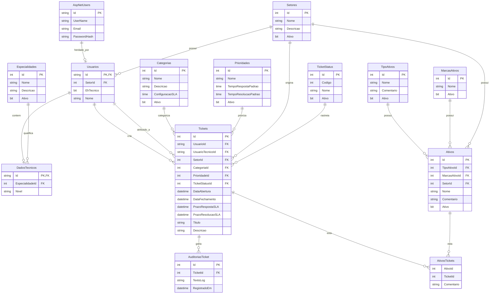

```mermaid
erDiagram
    %% Tabela Base do ASP.NET Identity (Mantida no padrão do framework)
    AspNetUsers {
        string Id PK
        string UserName
        string Email
        string PasswordHash
    }

    %% Usuario Comum (Herda de AspNetUsers)
    Usuarios {
        string Id PK, FK
        int SetorId FK
        bit EhTecnico
        string Nome
    }

    %% Dados Tecnicos
    DadosTecnicos {
        string Id PK, FK
        int EspecialidadeId FK
        string Nivel
    }

    %% Especialidade: Redes, Banco de Dados
    Especialidades {
        int Id PK
        string Nome
        string Descricao
        bit Ativo
    }

    %% Prioridade e Prazos Configurados
    Prioridades {
        int Id PK
        string Nome
        time TempoRespostaPadrao
        time TempoResolucaoPadrao
        bit Ativo
    }

    %% Categoria do Chamado: Redes, Hardware, Acessos
    Categorias {
        int Id PK
        string Nome
        string Descricao
        time ConfiguracaoSLA
        bit Ativo
    }

    %% Setor da Empresa
    Setores {
        int Id PK
        string Nome
        string Descricao
        bit Ativo
    }

    %% Notebook, PC, Roteador
    TipoAtivos {
        int Id PK
        string Nome
        string Comentario
        bit Ativo
    }

    %% Dell, Acer, Samsung, Genérico
    MarcasAtivos {
        int Id PK
        string Nome
        bit Ativo
    }

    %% Ativos
    Ativos {
        int Id PK
        int TipoAtivoId FK
        int MarcasAtivoId FK
        int SetorId FK
        string Nome
        string Comentario
        bit Ativo
    }

    %% Aberto, Em Atendimento, Pendente, Resolvido
    TicketStatus {
        int Id PK
        int Codigo
        string Nome
        bit Ativo
    }

    %% Ordem de Serviço / Chamado
    Tickets {
        int Id PK
        string UsuarioId FK
        string UsuarioTecnicoId FK
        int SetorId FK
        int CategoriaId FK
        int PrioridadeId FK
        int TicketStatusId FK
        datetime DataAbertura
        datetime DataFechamento
        datetime PrazoRespostaSLA
        datetime PrazoResolucaoSLA
        string Titulo
        string Descricao        
    }

    AtivosTickets {
        int AtivoId
        int TicketId
        string Comentario
    }

    %% Auditoria / Historico
    AuditoriasTicket {
        int Id PK
        int TicketId FK
        string TextoLog
        datetime RegistradoEm
    }

    %% Relacionamentos de Heranca (1 para 0..1)
    AspNetUsers ||--o| Usuarios : "herdado_por"
    Usuarios ||--o| DadosTecnicos : "contem"

    %% Demais Relacionamentos
    Setores ||--o{ Usuarios : "possui"
    Usuarios ||--o{ Tickets : "cria"
    Usuarios ||--o{ Tickets : "atribuido_a"
    Especialidades ||--o{ DadosTecnicos : "qualifica"
    Categorias ||--o{ Tickets : "categoriza"
    Prioridades ||--o{ Tickets : "prioriza"
    Setores ||--o{ Tickets : "origina"
    TicketStatus ||--o{ Tickets : "rastreia"
    Tickets ||--o{ AuditoriasTicket : "geria"
    TipoAtivos ||--o{ Ativos : "possui"
    MarcasAtivos ||--o{ Ativos : "possui"
    Setores ||--o{ Ativos : "possui"
    Tickets ||--o{ AtivosTickets : "esta"
    Ativos ||--o{ AtivosTickets : "esta"
```
